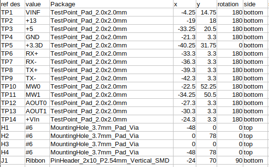
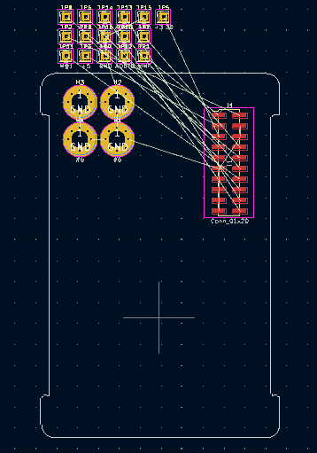
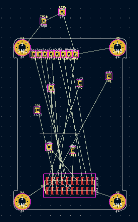

# kicad-parts-placer

<https://maskset.net/kicad-parts-placer.html>

+ Exact batch placement of components in a layout
+ Groups the components allowing them to be moved and positioned as a group, easily ensuring exact alignment
+ Useful for:
  + Creating bed of nails tester
  + Positioning mechanically important parts
  + Maintaining a form factor across different designs

## Example Use: Pogo pin & test pad placement
The project at <https://github.com/snhobbs/kicad-parts-placer/tree/master/example/example-placement> shows an example use.
This takes a centroid file from an existing design which is edited for input.



A schematic is drawn up with matching reference designators:


The schematic is exported to a PCB which will look like this:



Running the script on this board with this command exports the following board with the components exactly aligned ready for layout. The group can be treated as a footprint, placed where ever is useful. During layout you only have to deal with a single coordinate as the position within the group is locked.

```{python}
kicad-parts-placer --pcb example-placement.kicad_pcb --config centroid-all-pos.csv --out example-placement_placed.kicad_pcb -x 117.5 -y 53
```




### Procedure: Existing board needs a tester
1. Export test pad locations & type to a spreadsheet
2. Plugin exports pad type, position, ref des, & value from DUT
3. Extend the exported data, choosing the pogo pin footprint, mounting holes, connectors, etc. This is useful for the placement of mechanically important parts and form factor compliance.
4. Batch load parts into schematic
5. Complete schematic as needed, batch loading can be repeated or bom exported & checked for consistency
6. Update PCB from schematic (f8)
7. Run script which moves existing ref des to the location in config

### Placing Test Pads to Reuse a Tester
+ Can follow same workflow as making a tester or copy from the existing board that uses the tester
+ Script should have a check placement function that is read only

## Matching Form Factor
+ Ensure position, type, & rotation match a certain description.
+ The grouped components then only need 2 dimensions locked to a reference to get correct.

## Critical component placement
+ Exact placement of mounting holes, sensors, connectors, etc

## Notes
+ Place parts in pcb layout from a configuration table.
+ Allows writing a config script which fully defines the parts
+ Connections are made either by updating from a schematic or passing a netlist
+ Use example of schematic to pcb placement
+ All parts are grouped together, locking their relative placement
+ Internal configuration is a dataframe with ref des, label/value, footprint, position x, position y. Notes fields can be added for documentation generation.
+ A separate config object can be that could pull in a board outline, stackup, etc describing the board.
+ Position, rotation, & ref des are available in the centroid file, that avoids requiring the source board be kicad.


## Installation
### PyPi
All you need to run is:
```
pip install kicad-parts-placer
```

### Source
To install from source:
```
git clone https://github.com/snhobbs/kicad-parts-placer
cd kicad-parts-placer
pip install .
```

## References
+ Openscad test jig generator: https://tinylabs.io/openfixture-config/
+ Manual kicad location extraction: https://tinylabs.io/openfixture-kicad-export/
+ Hackaday test jigs: https://hackaday.com/2016/08/24/tools-of-the-trade-test-and-programming/#more-218337
+ https://www.testjigfactory.com/
+ https://climbers.net/sbc/home-lab-pcb-programming-test-jig/
+ Kicad schematic to pcb position: https://github.com/ian-ross/kicad-plugins
+ Test pad to openscad pin placement: https://github.com/5inf/TestPointReport2STL
